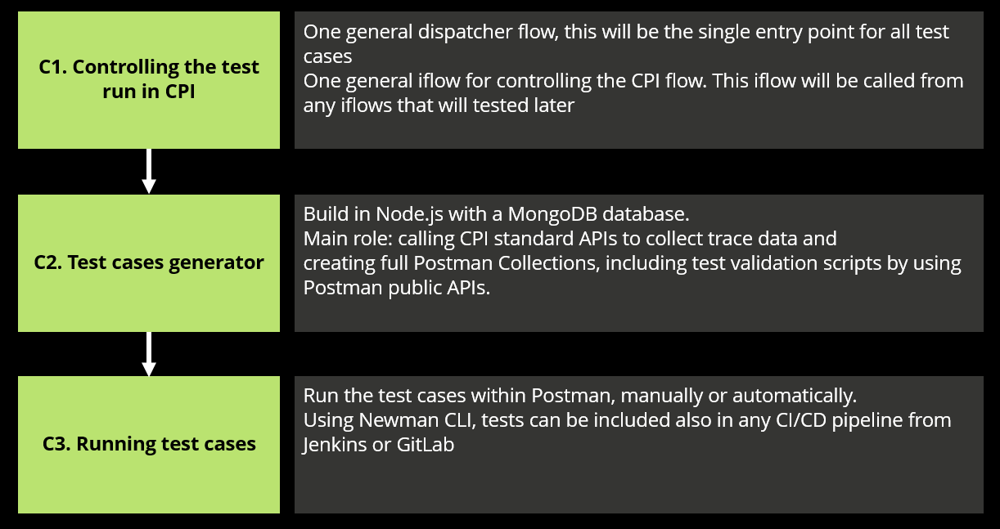
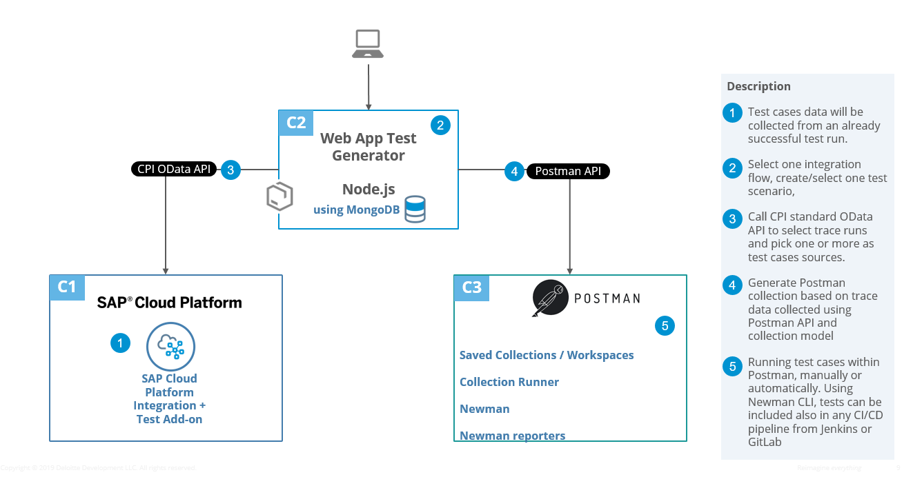
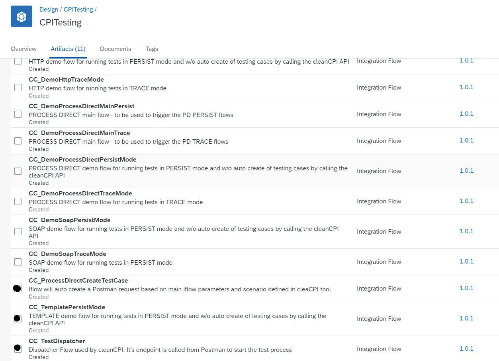
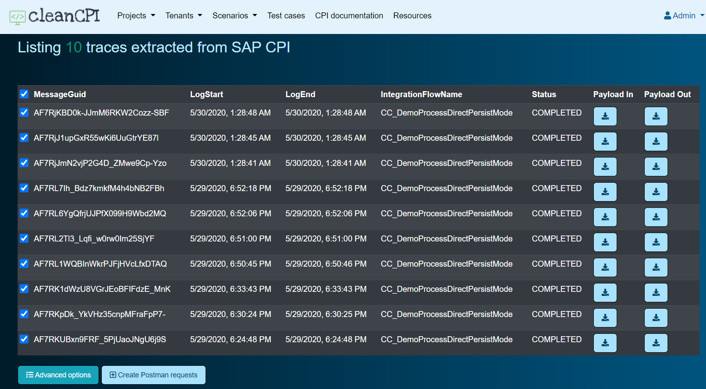
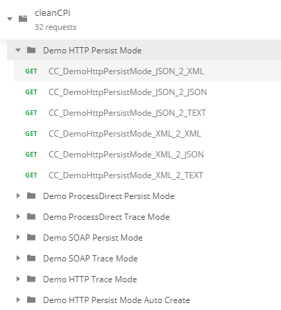

# Table of Contents

*   [Introduction](#introduction)
*   [Architecture](#architecture)
*   [Main functionalities](#main-functionalities)
*   [What's included in the package](#What-is-included-in-the-package)
*   [Deployment options](#Deployment-options)
*   [Onboarding steps](#Onboarding-steps)

# Introduction
CleanCPI is a package tool that supports running cloud integration in an SAP environment. It is a multi-feature tool scoping assets around areas like testing automation, cloud EDI, CPI documentation, though we will be focusing in this readme document more on the testing automation feature.

Testing is a very important process in an integration project. Due to SAP Cloud Platform particularities and lack of a standard SAP feature, the tool provides a custom solution for the build team but also for the run team to create, execute and evaluate single or bulk test scenarios.

SAP CPI integrates SAP or non-SAP solutions in simple or more complex end to end scenarios. The goal of the testing feature is to concentrate the testing process on SAP CPI by isolating the testing process and having the option to exclude the 3rd party systems in any regression testing performed in all project phases. For this we are using a method similar with what _Rotoscoping_ (https://en.wikipedia.org/wiki/Rotoscoping) is for visual design: "use to trace over motion picture footage, frame by frame, to produce realistic action"... "By tracing an object, the moviemaker creates a silhouette (called a matte) that can be used to extract that object from a scene for use on a different background". "_Rotoscoping is a process by which actors are filmed on sets, then drawn over by animators, which creates a world that is not quite real but not quite imaginary, either."_

In the same way our testing tool is working - we select the execution runs that were validated as an end-to-end process, extract the trace data behind those executions and 
generate different test cases having the same or a changed context depending on each test scenario.

# Architecture

cleanCPI package consists of three components:
1. CPI package: 3 main iflow types: 
   - Flows that supports the tool functionality
   - Template flow for creating new flows with special testing functionality included
   - Demo flows - to test various testing scenarios
1. Postman account, collections and environments

1. Web app (Node.js + Express, MongoDB):
   
   Backend, Frontend, API, Security subcomponents

# Main Functionalities

### Data Model

Data used by the tool is stored inside the MongoDB collections:
- Project
- Tenant
- Scenario
- User

One Project has one or more Tenants
One Tenant has one or more Scenarios

### Projects, Tenants, Scenarios entities
A project can be a new CPI implementation, a migration from PI/PO to CPI or just an internal integration project. Postman API key is one important attribute maintained at the project level as this should be available for all the tenants inside the project. 

CPI tenants are represented inside the Tenant collection and consist of attributes like tenant URL, test dispatcher flow URL, user and password for the technical user. All sensitive data including passwords are encrypted in the database collection.

Testing Scenarios are created for each CPI flows that will to be tested and include all the attributes required to read the CPI payloads and to generate the Postman requests.

### User management built in
For user authentication and authorization we are using the passport and passport-local node modules and a User collection in MongoDB where the user data is stored. For now only admin and non-admin users are handled.

### Create and synchronize Postman environments for each tenant
Test cases created from one tenant source can be executed on any other tenant just by switching the environment in Postman (and of course having the CPI testing package configured in advance for that tenant). For each tenant defined in cleanCPI an environment can be created and sync with Postman. This option is included in the tenant detailed view.

### Extract CPI flows executions data in two main modes: Trace or Persist
Test cases in cleanCPI are created based on prior completed runs. Extracting the data from old runs can be done in two modes, depending on scenario definition:
  - Trace Mode - using the standard SAP CPI trace data feature - in this case no special steps are required in the flow definition
  - Persist Mode - using dedicated steps inside the flows

Each test mode has different use cases, depending on the integration flow particularity. Trace Mode is easier to implement for already existing flow definitions - even SAP standard flows, Persist Mode on the other hand uses some additional logic included in the flow definition to enable extended testing options.

### Create Postman test cases
Creating the test cases is the ultimate goal of the web component. For one particular test scenario and based on old completed execution runs, test cases are created as Postman requests and include details like request payload, headers, endpoint and of course test scripts. 

### Module to customize the generated Postman test script based on payload and headers
A set of advanced options are available in the tool to control the way that test scripts are created, like encoding the payload, evaluating the full output payload, evaluating particular header existence or/and values, evaluating particular payload parts/nodes.

### Backend API to update Postman collection - called by the web app but also from CPI directly in the auto mode
Test cases are created by calling an API created on the webtool backend component. This gives the flexibility of calling the API in a secure way from any other system. One important feature is included in the CPI package by calling the create request API inside the flow and generating the test case automatically.

### Resource page with documents and CPI packages related to the tool but not limited
As part of the web tool, we included a resource page synchronized online with a AWS S3 bucket where content like best practices, cpi packages, documents, etc will be posted. CPI packages will have the option to be downloaded directly into the tenants configured in the tool.

# What is included in the package
CleanCPI is delivered as a bundle of components that includes:
- a CPI package with 3 different types of flows:
   - Flows that supports the tool functionality
   - Template flow for creating new flows with special testing functionality included
   - Demo flows - to test various testing scenarios

   
- the web component source app deployed as a Node.js + MongoDB
   
- Postman collection that includes demo requests for the demo CPI flows included. With these demo requests the tool can be tested for different payload scenarios (json to json, xml or text, xml to xml, json or text).

# Deployment options
The tool can run fully on cloud or in a hybrid landscape and is not dependent on any SAP existing backend solution. Deployment options come into picture for the web component that can run on a local server, on SAP Cloud Platform or on any other cloud provider platform. 
All the web tool components are Docker containerized and any deployment can be done in minutes (e.g. SAP Cloud Platform Cloud Foundry). Also, a GitHub repository is available for any other custom deployment. 

# Onboarding steps

* Install the web app and maintain the basic configuration data sets

* Copy the CPI package to your tenants and configure the iflows

* Create a Postman account

* Configure your Postman account - create API key, collection structure, etc
* Create your first iflow based on the template or use an existing iflow to create your first test case

